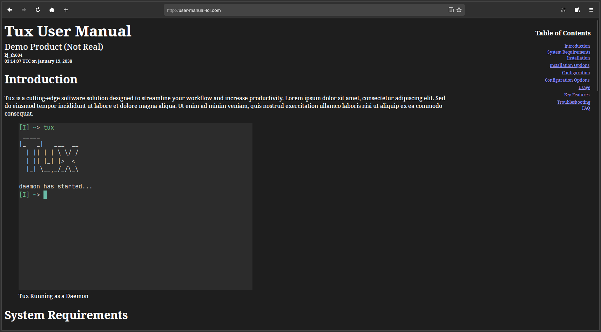
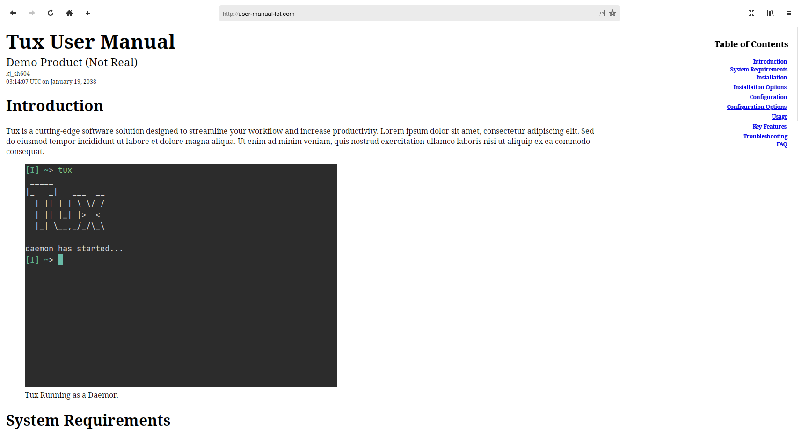
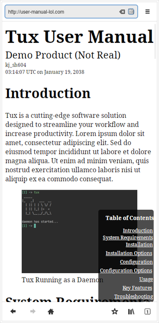

# Markdown to User Manual via `pandoc` 📃

This script generates an .html, .pdf, .odt, and .docx file for a user manual and/or technical documentation — all from a single markdown file (`user-manual.md`). The documents are generated with `pandoc` and standard POSIX/GNU core utilities.

This project was derived from another personal project of mine, [pandoc-resume](https://github.com/kj-sh604/pandoc-resume)

## Features

### HTML Output
- Minimal footprint, `styles.css` only contain styles needed for responsive UX.
- Automatically generates a "table of contents" transformed into a modal menu bar with its subsections.

### Document Output
- Extensive LaTeX template (`template.tex`) for a less "LaTeX-y"-looking document.
- Utilizes standard `pandoc` features to generate a .docx and .odt file

## Screengrabs 📹📸

Dark Mode 🌙 and Light Mode 💡 are auto-applied based on the user's system settings.

Auto-generated Table of Contents Navigation can be found on the right-hand side of the page as a modal.

### Desktop 🖥

#### Dark Mode

#### Light Mode

### Mobile 📱

#### Dark Mode

#### Light Mode

### Document Example 📄

#### PDF Output

### Site Navigation Example 📼

<!-- [Site Navigation Demo](static_README/navigation-demo.webm) -->
[Site Navigation Demo](https://github.com/user-attachments/assets/a9a082c7-a7cd-4881-a0fd-a60757b5c6f7)

Browser-native smooth scrolling and navigation ✨.

## Dependencies 🔗 
* pandoc
* LaTeX
* make
* POSIX-compatible environment

### Installation Instructions for Dependencies ⬇️ 📦

#### macOS (with Homebrew and .pkg dependencies):

1. Install Homebrew if you haven't already: `/bin/bash -c "$(curl -fsSL https://raw.githubusercontent.com/Homebrew/install/HEAD/install.sh)"`
2. Update Homebrew: `brew update`
3. Install the full [MacTeX package](https://tug.org/mactex/mactex-download.html)
4. Install pandoc and recommended dependencies via Homebrew:
   - `brew install pandoc`
   - `brew install imagemagick` (for image conversion)
   - `brew install librsvg` (for SVG support)
   - `brew install libxml2` (for XML support)
   - `brew install make` (for building and compiling)

note: on macOS, you may need to install xcode and the xcode command line tools before installing homebrew.

#### Ubuntu:

1. Update the package index: `sudo apt update`
2. Install pandoc and recommended dependencies:
   - `sudo apt install pandoc`
   - `sudo apt install texlive-full` (for LaTeX support)
   - `sudo apt install imagemagick` (for image conversion)
   - `sudo apt install librsvg2-bin` (for SVG support)
   - `sudo apt install libxml2-utils` (for XML support)
   - `sudo apt install build-essential` (includes make, for building and compiling)

#### Arch Linux:

1. Update the package index: `sudo pacman -Syy`
2. Install pandoc and recommended dependencies:
   - `sudo pacman -S pandoc`
   - `sudo pacman -S texlive texlive-lang` (for LaTeX support)
   - `sudo pacman -S imagemagick` (for image conversion)
   - `sudo pacman -S librsvg` (for SVG support)
   - `sudo pacman -S libxml2` (for XML support)
   - `sudo pacman -S base-devel` (includes make, for building and compiling)

#### Windows
* Please refer to this official pandoc document for installation instructions: https://pandoc.org/installing.html#windows

## Usage 🛠

* running `make` or `make compile` builds all the assets
* `make clean` deletes all the generated assets

### Output ⚙
* The website output (HTML) of the script will be found in the `public/` directory.
* All document output (PDF, Word, Open Document Format) will be found in the `output/` directory.
