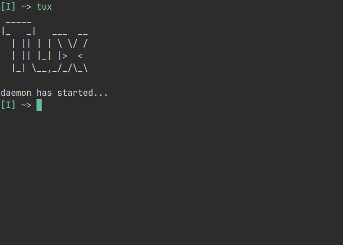
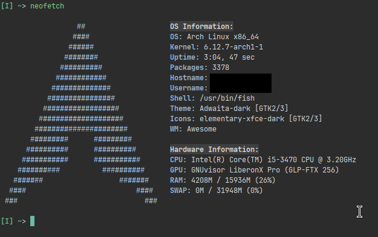

<!-- Templating Stuff -->
<meta name="color-scheme" content="light dark"> <!-- this allows native HTML dark mode and light mode for users -->
\break <!-- this is a page break macro -->

<!-- Main Content Starts Here -->
# Introduction

Tux is a cutting-edge software solution designed to streamline your workflow and increase productivity. Lorem ipsum dolor sit amet, consectetur adipiscing elit. Sed do eiusmod tempor incididunt ut labore et dolore magna aliqua. Ut enim ad minim veniam, quis nostrud exercitation ullamco laboris nisi ut aliquip ex ea commodo consequat.

\break

# System Requirements

* Operating System: Linux, UNIX, or macOS High Sierra (or later)
* Processor: Intel Celeron or AMD equivalent
* Memory: 8 GB RAM (16 GB recommended)
* Storage: 64 GB available disk space
* Graphics: GNUvisor LiberonX Pro (GLP-FTX 256) or NVIDIA/AMD equivalent

Lorem ipsum dolor sit amet, consectetur adipiscing elit. Sed do eiusmod tempor incididunt ut labore et dolore magna aliqua. Ut enim ad minim veniam, quis nostrud exercitation ullamco laboris nisi ut aliquip ex ea commodo consequat.

# Installation

1. Download the Tux installer from our [website](https://www.google.com).
2. Run the installer and follow the prompts to select the installation location.
3. Wait for the installation to complete.

## Installation Options

* **Standard Installation**: Installs the full version of Tux with all features. Lorem ipsum dolor sit amet, consectetur adipiscing elit. Sed do eiusmod tempor incididunt ut labore et dolore magna aliqua.
* **Custom Installation**: Allows you to select specific features to install. Ut enim ad minim veniam, quis nostrud exercitation ullamco laboris nisi ut aliquip ex ea commodo consequat.

# Configuration

1. Launch Tux and select your preferred language.
2. Configure your user account and password.
3. Set up your project workspace and preferences.

## Configuration Options

* **Project Settings**: Configure project-specific settings, such as project name and description. Lorem ipsum dolor sit amet, consectetur adipiscing elit. Sed do eiusmod tempor incididunt ut labore et dolore magna aliqua.
* **User Settings**: Configure user-specific settings, such as username and password. Ut enim ad minim veniam, quis nostrud exercitation ullamco laboris nisi ut aliquip ex ea commodo consequat.

# Usage

1. Launch Tux and select your project workspace.
2. Create a new project or open an existing one.
3. Use the various tools and features to complete your project.

## Key Features

* **Project Management**: Manage your projects and tasks with ease. Lorem ipsum dolor sit amet, consectetur adipiscing elit. Sed do eiusmod tempor incididunt ut labore et dolore magna aliqua.
* **Collaboration**: Collaborate with team members in real-time. Ut enim ad minim veniam, quis nostrud exercitation ullamco laboris nisi ut aliquip ex ea commodo consequat.
* **Reporting**: Generate reports and analytics to track progress. Duis aute irure dolor in reprehenderit in voluptate velit esse cillum dolore eu fugiat nulla pariatur.

# Troubleshooting

* **Common Issues**: Check our knowledge base for common issues and solutions. Lorem ipsum dolor sit amet, consectetur adipiscing elit. Sed do eiusmod tempor incididunt ut labore et dolore magna aliqua.
* **Error Messages**: Check the error message for troubleshooting tips. Ut enim ad minim veniam, quis nostrud exercitation ullamco laboris nisi ut aliquip ex ea commodo consequat.
* **Contact Support**: Contact our support team for assistance. Duis aute irure dolor in reprehenderit in voluptate velit esse cillum dolore eu fugiat nulla pariatur.

# FAQ

* **Q: What is Tux?**
A: Tux is a software solution designed to streamline your workflow and increase productivity. Lorem ipsum dolor sit amet, consectetur adipiscing elit. Sed do eiusmod tempor incididunt ut labore et dolore magna aliqua.
* **Q: How do I install Tux?**
A: Download the installer from our website and follow the prompts. Ut enim ad minim veniam, quis nostrud exercitation ullamco laboris nisi ut aliquip ex ea commodo consequat.
* **Q: What are the system requirements for Tux?**
A: Check the system requirements section for details. Duis aute irure dolor in reprehenderit in voluptate velit esse cillum dolore eu fugiat nulla pariatur.
